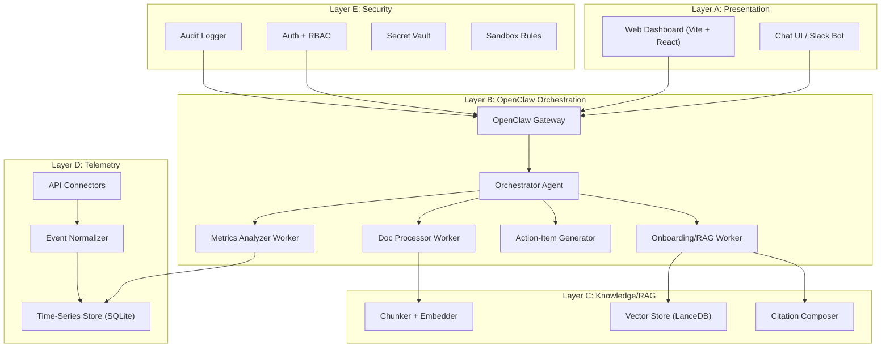

# Integrated Team Intelligence System (ITIS) — Implementation Plan

## Environment Validation ✅

| Dependency | Required | Available | Status |
|---|---|---|---|
| Node.js | ≥22.14 | v24.11.1 | ✅ |
| npm | latest | 11.6.2 | ✅ |
| Python | ≥3.10 | 3.14.0 | ✅ |
| OpenClaw | latest | 2026.5.4 | ✅ |
| WSL2 | recommended | Ubuntu 24.04 | ✅ |

> [!IMPORTANT]
> OpenClaw runs natively on this Windows system (Node.js v24). WSL2 is available as fallback. We will attempt **native Windows first**, falling back to WSL2 only if the daemon has issues.

---

## Architecture Overview



---

## Tech Stack Decisions

| Layer | Technology | Rationale |
|---|---|---|
| Orchestration | **OpenClaw 2026.5.4** | Mandatory requirement; gateway + agents + skills + memory |
| Backend API | **Express.js** (Node.js) | Same runtime as OpenClaw; skills can call API directly |
| Frontend | **Vite + React** | Fast dev, premium UI |
| Database | **SQLite (better-sqlite3)** | Zero-config, Windows-native, sufficient for hackathon |
| Vector Store | **LanceDB** | Local-first, Node.js native, no server needed |
| Embeddings | **OpenAI text-embedding-3-small** or local via Ollama | Configurable; fallback to local |
| LLM | **Configurable via OpenClaw** | Claude/GPT/Ollama — model-agnostic |
| Auth | **JWT + bcrypt** | Simple, stateless, proven |
| Charts | **Recharts** | React-native, beautiful defaults |
| CSS | **Vanilla CSS** with design tokens | Per project guidelines |

---

## User Review Required

> [!WARNING]
> **LLM API Key**: OpenClaw requires at least one LLM provider API key (OpenAI, Anthropic, or local Ollama). Which provider and key should we configure?

> [!IMPORTANT]
> **Telemetry APIs**: Phases 5+ require API tokens for GitHub, Jira/Trello, Google Calendar, and Slack. For the hackathon demo, we'll use **mock data** initially and add real connectors later. Is this acceptable?

> [!IMPORTANT]
> **Slack Bot**: A real Slack bot requires a Slack App with Bot Token. For early phases, we'll build a **web-based chat UI** that mirrors Slack UX and can be swapped for real Slack integration. Acceptable?

## Open Questions

1. **LLM Provider**: Do you have an OpenAI or Anthropic API key available? Or should we use Ollama for fully local inference?
2. **Demo Data**: Should we create fictional company docs (HR policies, onboarding guides) for the RAG demo, or do you have real documents?
3. **Tenant Scope**: For hackathon, is a single-tenant demo sufficient, or must we demonstrate multi-tenant isolation?
4. **Deployment Target**: Local demo only, or do you need cloud deployment (Vercel/Railway/etc.)?

---

## Proposed Changes — Phase-by-Phase

---

### Phase 0: Foundation & Project Memory

**Goal**: Repo skeleton, config, conventions, project memory system.

#### [NEW] Project Root Structure
```
samsung prism/
├── openclaw/                    # OpenClaw workspace
│   ├── openclaw.json            # Gateway config
│   ├── SOUL.md                  # Orchestrator personality
│   ├── MEMORY.md                # Persistent memory
│   ├── HEARTBEAT.md             # Proactive tasks
│   ├── agents/                  # Worker agent definitions
│   │   ├── onboarding-rag/
│   │   ├── metrics-analyzer/
│   │   ├── action-generator/
│   │   └── doc-processor/
│   └── skills/                  # Deterministic skills
│       ├── query-docs/
│       ├── compute-metrics/
│       ├── generate-checklist/
│       └── create-reminder/
├── backend/                     # Express.js API server
│   ├── src/
│   │   ├── index.js
│   │   ├── db/
│   │   ├── routes/
│   │   ├── middleware/
│   │   ├── services/
│   │   └── utils/
│   ├── package.json
│   └── .env.example
├── frontend/                    # Vite + React dashboard
│   ├── src/
│   │   ├── main.jsx
│   │   ├── App.jsx
│   │   ├── index.css
│   │   ├── components/
│   │   ├── pages/
│   │   └── api/
│   ├── package.json
│   └── index.html
├── docs/                        # Company docs for RAG
├── data/                        # SQLite DBs, vector store
├── tests/                       # Test suites
├── memory/                      # Project memory & checkpoints
│   ├── checkpoint.md
│   └── resume-packet.md
└── README.md
```

#### Verification Gate
- [ ] All directories exist
- [ ] `package.json` files valid
- [ ] Checkpoint template writable/readable
- [ ] Config loads without error

---

### Phase 1: Database & Identity

**Goal**: Users, tenants, roles, events, metrics — all storable.

#### [NEW] [schema.sql](file:///c:/Users/Rohan/OneDrive/Desktop/samsung%20prism/backend/src/db/schema.sql)
Tables: `tenants`, `users`, `roles`, `user_roles`, `onboarding_tasks`, `onboarding_progress`, `events`, `metrics`, `audit_logs`, `documents`, `chunks`

#### [NEW] [db.js](file:///c:/Users/Rohan/OneDrive/Desktop/samsung%20prism/backend/src/db/db.js)
SQLite connection manager using `better-sqlite3`

#### [NEW] [auth.js](file:///c:/Users/Rohan/OneDrive/Desktop/samsung%20prism/backend/src/middleware/auth.js)
JWT verification, RBAC middleware

#### [NEW] [users.js](file:///c:/Users/Rohan/OneDrive/Desktop/samsung%20prism/backend/src/routes/users.js)
CRUD for users with tenant isolation

#### Verification Gate
- [ ] CRUD operations work for all tables
- [ ] Tenant isolation enforced (user A can't see tenant B data)
- [ ] Role assignment works
- [ ] Audit log captures write operations

---

### Phase 2: OpenClaw Setup & Orchestration

**Goal**: OpenClaw as the actual routing engine.

#### [NEW] [openclaw.json](file:///c:/Users/Rohan/OneDrive/Desktop/samsung%20prism/openclaw/openclaw.json)
Gateway configuration: LLM provider, model settings, agent registry, memory plugin config

#### [NEW] [SOUL.md](file:///c:/Users/Rohan/OneDrive/Desktop/samsung%20prism/openclaw/SOUL.md)
Orchestrator identity: route requests to correct worker based on intent classification

#### [NEW] [MEMORY.md](file:///c:/Users/Rohan/OneDrive/Desktop/samsung%20prism/openclaw/MEMORY.md)
Persistent facts: user preferences, onboarding state, project context

#### [NEW] [HEARTBEAT.md](file:///c:/Users/Rohan/OneDrive/Desktop/samsung%20prism/openclaw/HEARTBEAT.md)
Scheduled tasks: daily summaries, reminder checks, metrics refresh

#### [NEW] Agent definitions (4 workers)
Each in `agents/<name>/AGENTS.md` with SOUL, skills, and bounded responsibilities:
- **onboarding-rag**: Answer HR questions, manage checklists
- **metrics-analyzer**: Compute team velocity, cycle time, blockers
- **action-generator**: Create action items, reminders, nudges
- **doc-processor**: Ingest, chunk, embed documents

#### [NEW] Skills (4 deterministic runbooks)
Each in `skills/<name>/SKILL.md`:
- **query-docs**: Retrieve chunks → compose cited answer
- **compute-metrics**: Aggregate events → produce metric JSON
- **generate-checklist**: Role → onboarding task list
- **create-reminder**: Task + deadline → reminder payload

#### Verification Gate
- [ ] `openclaw gateway start` succeeds
- [ ] Sending a message routes to correct worker
- [ ] Memory persists across turns
- [ ] Skills execute deterministically

---

### Phase 3: Document Ingestion & RAG

**Goal**: Trustworthy, citation-grounded answers from company docs.

#### [NEW] [ingestion.js](file:///c:/Users/Rohan/OneDrive/Desktop/samsung%20prism/backend/src/services/ingestion.js)
Parse PDF/MD/TXT → chunk (512 tokens, 50 overlap) → embed → store in LanceDB

#### [NEW] [retrieval.js](file:///c:/Users/Rohan/OneDrive/Desktop/samsung%20prism/backend/src/services/retrieval.js)
Query vector store → re-rank → return top-k with metadata

#### [NEW] [citation.js](file:///c:/Users/Rohan/OneDrive/Desktop/samsung%20prism/backend/src/services/citation.js)
Format answers with `[Source: doc_name, page X]` citations

#### [NEW] Sample docs in `docs/`
- `employee-handbook.md`
- `onboarding-guide.md`
- `benefits-policy.md`
- `it-setup-guide.md`

#### Verification Gate
- [ ] Chunks stored with correct metadata
- [ ] Relevant chunks retrieved for test queries
- [ ] Citations map to actual source chunks
- [ ] "I don't have enough information" for out-of-scope questions

---

### Phase 4: Chat Orchestration & Reminders

**Goal**: Working onboarding assistant conversation flow.

#### [NEW] [chat.js](file:///c:/Users/Rohan/OneDrive/Desktop/samsung%20prism/backend/src/routes/chat.js)
Chat endpoint → OpenClaw gateway → response

#### [NEW] [intent.js](file:///c:/Users/Rohan/OneDrive/Desktop/samsung%20prism/backend/src/services/intent.js)
Classify: policy_question | checklist_status | reminder_request | task_creation | feedback

#### [NEW] [checklist.js](file:///c:/Users/Rohan/OneDrive/Desktop/samsung%20prism/backend/src/services/checklist.js)
Onboarding checklist engine: role-based tasks, progress tracking

#### [NEW] [reminders.js](file:///c:/Users/Rohan/OneDrive/Desktop/samsung%20prism/backend/src/services/reminders.js)
Reminder scheduler: create, check, trigger via HEARTBEAT

#### Verification Gate
- [ ] Intent classified correctly for 5 test messages
- [ ] Checklist progress updates persisted
- [ ] Reminders created and retrievable
- [ ] Full onboarding conversation completes end-to-end

---

### Phase 5: Telemetry Ingestion

**Goal**: Normalized work signals from external tools.

#### [NEW] Connectors in `backend/src/services/connectors/`
- `github.js` — PR events, commits, reviews
- `jira.js` — ticket transitions, story points
- `calendar.js` — meeting count, duration
- `slack-meta.js` — channel activity metadata (no message content)

#### [NEW] [normalizer.js](file:///c:/Users/Rohan/OneDrive/Desktop/samsung%20prism/backend/src/services/normalizer.js)
Unified event schema: `{source, type, actor, timestamp, metadata}`

#### [NEW] [mock-data.js](file:///c:/Users/Rohan/OneDrive/Desktop/samsung%20prism/backend/src/services/mock-data.js)
Realistic synthetic data generator for demo

#### Verification Gate
- [ ] Mock connectors produce valid normalized events
- [ ] Schema validation passes for all event types
- [ ] Duplicate events handled
- [ ] Missing-data scenarios handled gracefully

---

### Phase 6: Productivity Analytics

**Goal**: Actionable metrics from telemetry data.

#### [NEW] [analytics.js](file:///c:/Users/Rohan/OneDrive/Desktop/samsung%20prism/backend/src/services/analytics.js)
Compute: cycle time, lead time, velocity, PR throughput, meeting load, blocker count

#### [NEW] [summaries.js](file:///c:/Users/Rohan/OneDrive/Desktop/samsung%20prism/backend/src/services/summaries.js)
Weekly team summary generation via OpenClaw metrics-analyzer worker

#### [NEW] [analytics routes](file:///c:/Users/Rohan/OneDrive/Desktop/samsung%20prism/backend/src/routes/analytics.js)
API endpoints for dashboard consumption

#### Verification Gate
- [ ] Same input → same metric output (deterministic)
- [ ] Summaries are coherent and explainable
- [ ] API returns correct data shapes

---

### Phase 7: Burnout & Overload Signals

**Goal**: Respectful, metadata-only risk detection.

#### [NEW] [signals.js](file:///c:/Users/Rohan/OneDrive/Desktop/samsung%20prism/backend/src/services/signals.js)
Detect: sustained high meeting load, blocked tasks, after-hours activity patterns

#### Verification Gate
- [ ] Alerts trigger only on sustained patterns (not single events)
- [ ] No message content analyzed
- [ ] Messaging is neutral and actionable

---

### Phase 8: Role-Based Dashboard

**Goal**: Premium web dashboard with role-appropriate views.

#### [NEW] Frontend pages
- `Dashboard.jsx` — Manager view with charts
- `OnboardingChat.jsx` — New hire chat interface
- `TeamView.jsx` — Team velocity & health
- `AdminPanel.jsx` — Tenant/user management

#### [NEW] Frontend components
- `MetricCard.jsx`, `VelocityChart.jsx`, `ChecklistProgress.jsx`
- `ChatWindow.jsx`, `MessageBubble.jsx`, `CitationBadge.jsx`
- `Sidebar.jsx`, `NavBar.jsx`, `RoleGuard.jsx`

#### [NEW] [index.css](file:///c:/Users/Rohan/OneDrive/Desktop/samsung%20prism/frontend/src/index.css)
Design system: dark theme, glassmorphism, CSS custom properties, animations

#### Verification Gate
- [ ] Each role sees only permitted data
- [ ] Charts render with real/mock data
- [ ] Responsive layout
- [ ] No secrets visible in browser

---

### Phase 9: Skills Gap & Onboarding Intelligence

**Goal**: AI-native personalization.

#### [NEW] [skills-gap.js](file:///c:/Users/Rohan/OneDrive/Desktop/samsung%20prism/backend/src/services/skills-gap.js)
Compare role requirements vs completed onboarding → recommend resources

#### Verification Gate
- [ ] Recommendations are relevant to role
- [ ] Scores update as tasks complete

---

### Phase 10: Security Hardening

**Goal**: Safe to demonstrate.

#### [MODIFY] All routes — add RBAC middleware
#### [MODIFY] All responses — strip internal URLs and tokens
#### [NEW] [security-tests.js](file:///c:/Users/Rohan/OneDrive/Desktop/samsung%20prism/tests/security-tests.js)
Token leak test, unauthorized access test, injection resilience test

#### Verification Gate
- [ ] No secrets in browser network tab
- [ ] Unauthorized requests return 403
- [ ] Prompt injection doesn't escalate privileges
- [ ] Audit logs contain no raw secrets

---

### Phase 11: Demo Polish & Hackathon Readiness

**Goal**: Impressive 2-minute demo.

#### [NEW] [seed.js](file:///c:/Users/Rohan/OneDrive/Desktop/samsung%20prism/backend/src/db/seed.js)
Pre-loaded demo data: users, team, events, onboarding progress

#### [NEW] [DEMO_SCRIPT.md](file:///c:/Users/Rohan/OneDrive/Desktop/samsung%20prism/DEMO_SCRIPT.md)
Step-by-step demo walkthrough

#### Verification Gate
- [ ] Demo runs without manual intervention
- [ ] Story is clear in under 2 minutes
- [ ] Graceful fallbacks for API failures

---

## Verification Plan

### Automated Tests
```bash
# Phase 1: DB tests
npm test -- --grep "database"

# Phase 2: OpenClaw routing
openclaw gateway status
npm test -- --grep "routing"

# Phase 3: RAG tests
npm test -- --grep "retrieval|citation"

# Phase 4-11: Integration & scenario tests
npm test
```

### Browser Tests
- Load dashboard, verify charts render
- Send chat message, verify cited response
- Switch roles, verify data masking
- Inspect network tab for secret exposure

### Manual Verification
- Full onboarding conversation walkthrough
- Manager dashboard review
- Demo script dry-run

---

## Execution Priority

> [!TIP]
> **Hackathon strategy**: We build a complete vertical slice first (Phases 0→1→2→3→4→8), then widen with analytics (5→6→7→9), then harden (10→11). This ensures a demo-able product at every checkpoint.

| Priority | Phases | Deliverable |
|---|---|---|
| 🔴 Critical Path | 0, 1, 2, 3, 4 | Working onboarding assistant with RAG |
| 🟡 Analytics | 5, 6, 7 | Team dashboard with metrics |
| 🟢 Polish | 8, 9, 10, 11 | Role views, intelligence, security, demo |

---

## Known Risks & Mitigations

| Risk | Impact | Mitigation |
|---|---|---|
| OpenClaw daemon issues on native Windows | High | WSL2 fallback ready |
| LLM API key not available | High | Ollama local fallback |
| LanceDB compatibility on Windows | Medium | Fall back to flat JSON vector store |
| Token window limits in long sessions | Medium | Checkpoint system in `memory/` |
| Real API tokens not available for telemetry | Low | Mock data covers demo |
